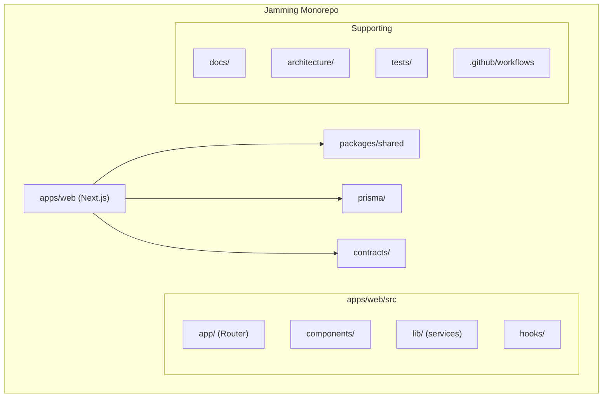

# Architecture 01: Project Folder Structure

## Purpose
Define the complete directory layout for the Jamming platform monorepo, ensuring separation of concerns, scalability, and clear ownership boundaries.

## Structure

```
jamming/
│
├── apps/                              # Application entry points
│   └── web/                           # Next.js web application
│       ├── src/
│       │   ├── app/                   # Next.js App Router (pages + API)
│       │   │   ├── (public)/          # Public routes
│       │   │   │   ├── events/        # Event browsing
│       │   │   │   ├── about/         # About page
│       │   │   │   └── legal/         # Privacy, Terms, Cookies
│       │   │   ├── (auth)/            # Auth routes
│       │   │   │   ├── login/
│       │   │   │   ├── register/
│       │   │   │   ├── forgot-password/
│       │   │   │   └── reset-password/
│       │   │   ├── (dashboard)/       # Organizer dashboard routes
│       │   │   │   ├── dashboard/
│       │   │   │   │   ├── events/
│       │   │   │   │   └── analytics/
│       │   │   │   └── scanner/
│       │   │   ├── tickets/           # User ticket views
│       │   │   ├── profile/           # User profile
│       │   │   ├── api/               # API routes
│       │   │   │   ├── auth/
│       │   │   │   ├── events/
│       │   │   │   ├── tickets/
│       │   │   │   ├── checkin/
│       │   │   │   ├── users/
│       │   │   │   ├── notifications/
│       │   │   │   ├── payments/      # Phase 2
│       │   │   │   └── blockchain/    # Phase 2
│       │   │   ├── layout.tsx         # Root layout
│       │   │   └── page.tsx           # Homepage
│       │   ├── components/            # React components
│       │   │   ├── ui/                # Shared design system components
│       │   │   ├── events/
│       │   │   ├── tickets/
│       │   │   ├── scanner/
│       │   │   ├── dashboard/
│       │   │   └── layout/
│       │   ├── lib/                   # Core utilities
│       │   │   ├── services/          # Business logic services
│       │   │   ├── validations/       # Zod schemas
│       │   │   ├── utils/
│       │   │   ├── constants.ts
│       │   │   ├── types.ts
│       │   │   ├── auth.ts            # NextAuth configuration
│       │   │   └── prisma.ts          # Prisma client singleton
│       │   ├── hooks/                 # Custom React hooks
│       │   ├── providers/             # React context providers
│       │   ├── styles/                # Global CSS
│       │   └── middleware.ts          # Next.js middleware
│       ├── public/                    # Static assets
│       ├── next.config.js
│       ├── tailwind.config.ts
│       ├── tsconfig.json
│       └── package.json
│
├── packages/                          # Shared packages (monorepo)
│   └── shared/                        # Shared types, constants, utilities
│       ├── src/
│       │   ├── types/                 # Shared TypeScript types
│       │   ├── constants/             # Shared constants
│       │   ├── validations/           # Shared Zod schemas
│       │   └── utils/                 # Shared utilities
│       ├── package.json
│       └── tsconfig.json
│
├── prisma/                            # Database layer
│   ├── schema.prisma                  # Prisma schema (single source of truth)
│   ├── migrations/                    # Auto-generated migrations
│   ├── seed.ts                        # Seed data script
│   └── client.ts                      # Prisma client singleton
│
├── contracts/                         # Smart contracts (Phase 2)
│   ├── contracts/
│   │   └── TicketVerification.sol
│   ├── scripts/
│   │   └── deploy.ts
│   ├── test/
│   ├── hardhat.config.ts
│   └── package.json
│
├── docs/                              # Product documentation (frozen v1.0)
│   ├── 01-Product-Vision.md
│   ├── ...
│   └── VERSION.md
│
├── architecture/                      # Architecture blueprint (this directory)
│   ├── 01-Project-Folder-Structure.md
│   └── ... (28 files total)
│
├── tests/                             # Test suites
│   ├── unit/                          # Unit tests (vitest)
│   ├── integration/                   # Integration tests (vitest + supertest)
│   └── e2e/                           # End-to-end tests (Playwright)
│
├── .github/                           # CI/CD configuration
│   └── workflows/
│       ├── ci.yml                     # Continuous integration
│       └── deploy.yml                 # Deployment pipeline
│
├── scripts/                           # Development scripts
│   ├── dev.sh
│   ├── seed.sh
│   └── db-reset.sh
│
├── .env.example                       # Environment variable template
├── .eslintrc.cjs                      # ESLint configuration
├── .prettierrc                        # Prettier configuration
├── .gitignore
├── package.json                       # Root package.json (workspaces)
├── tsconfig.base.json                 # Shared TypeScript config
├── README.md
└── turbo.json                         # Turborepo configuration (if using)
```

## Mermaid Diagram



## Key Design Decisions

| Decision | Rationale |
|----------|-----------|
| **Monorepo (not multi-repo)** | Single codebase, shared types, atomic commits across packages |
| **Single Next.js app (not separate FE/BE)** | Next.js API routes serve as backend; keeps deployment simple |
| **`packages/shared`** | Shared types between server and client (validation schemas, constants) |
| **`prisma/` at root** | Database schema is a cross-cutting concern, not owned by any single app |

## Risks

| Risk | Mitigation |
|------|-----------|
| Monorepo complexity as codebase grows | Start with simple structure; migrate to Turborepo/Nx if needed |
| Tight coupling between frontend and backend | Next.js API routes are versioned; shared package enforces contracts |
