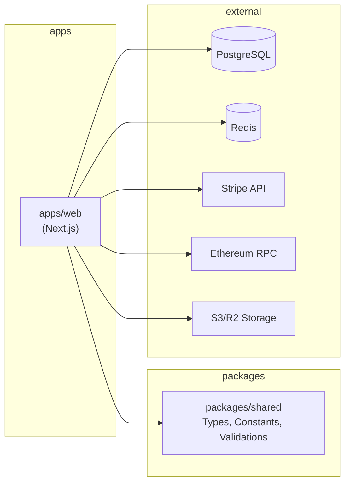

# Architecture 02: Monorepo Architecture

## Purpose
Define how the monorepo is structured, how packages relate to each other, and how code is shared across the codebase.

## Package Manager

**Tool:** npm workspaces (with pnpm as future option)

### Root package.json

```json
{
  "name": "jamming",
  "private": true,
  "workspaces": [
    "apps/*",
    "packages/*"
  ],
  "scripts": {
    "dev": "npm run dev --workspace=apps/web",
    "build": "npm run build --workspace=apps/web",
    "lint": "npm run lint --workspace=apps/web",
    "test": "npm run test --workspace=apps/web",
    "test:e2e": "npm run test:e2e --workspace=apps/web",
    "db:migrate": "npm run db:migrate --workspace=apps/web",
    "db:seed": "npm run db:seed --workspace=apps/web",
    "typecheck": "tsc --noEmit --project apps/web/tsconfig.json"
  }
}
```

## Dependency Graph



## Package Dependency Rules

| Rule | Description |
|------|-------------|
| **Downward only** | `apps/*` can depend on `packages/*`, never the reverse |
| **No circular** | `packages/shared` cannot depend on anything in `apps/` |
| **Explicit** | All cross-package imports are declared in `package.json` |
| **Bundled** | Shared package is transpiled and bundled (not consumed as source) |

## Shared Package Structure

```typescript
// packages/shared/src/types/index.ts
export * from './event';
export * from './ticket';
export * from './user';
export * from './api';

// packages/shared/src/constants/index.ts
export const TICKET_PREFIX = 'JAM';
export const MAX_CAPACITY = 10000;
export const MIN_TITLE_LENGTH = 5;

// packages/shared/src/validations/event.ts
import { z } from 'zod';
export const createEventSchema = z.object({
  title: z.string().min(5).max(100),
  // ...
});
```

## Build & Development Commands

```bash
# Development (all packages in watch mode)
npm run dev

# Build all packages
npm run build

# Type-check all packages
npm run typecheck

# Run tests for specific package
npm run test --workspace=apps/web

# Add dependency to a workspace
npm install zod --workspace=packages/shared

# Clean all node_modules
npm run clean
```

## Advantages

- **Shared types** — Single source of truth for TypeScript interfaces
- **Atomic commits** — Changes across packages in one commit
- **Simplified CI** — Single pipeline builds all packages
- **Dependency management** — No version mismatch across packages
- **Code reuse** — Validation schemas shared between frontend and backend

## Risks

| Risk | Mitigation |
|------|-----------|
| npm workspace hoisting issues | Pin dependency versions, use `npx` for consistency |
| Build order complexity | Keep `packages/shared` simple — no build step, import directly |
| Monorepo tooling overhead | Start simple with npm workspaces, add Turborepo only when needed |
