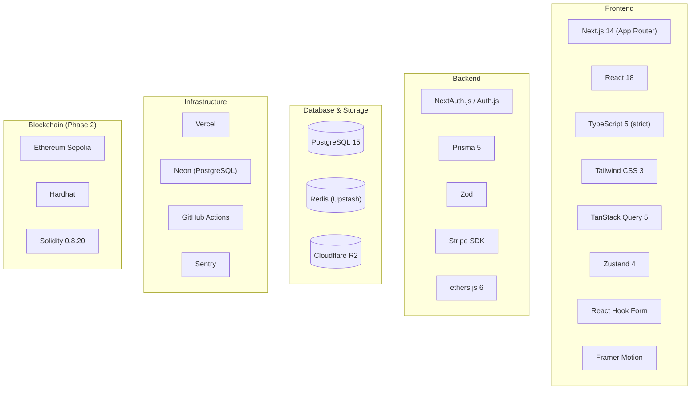

# Architecture 03: Technology Stack

## Purpose
Define the final technology stack with rationale for every choice, ensuring all team members understand why each tool was selected.

## Stack Overview

## Detailed Stack

### Frontend

| Technology | Version | Why This Choice | Alternatives Considered | Decision Driver |
|-----------|---------|-----------------|------------------------|-----------------|
| Next.js | 14+ (App Router) | Full-stack in one codebase, SSR/SSG, API routes, image optimization | Remix, Vite + React | Simplified deployment, built-in API layer |
| React | 18 | Industry standard, stable ecosystem | - | Ecosystem maturity, team familiarity |
| TypeScript | 5+ (strict) | Type safety, better DX, catch errors at compile time | JavaScript | Non-negotiable for production quality |
| Tailwind CSS | 3+ | Utility-first, rapid prototyping, small bundle | CSS Modules, Styled Components, Chakra | Design system alignment, rapid iteration |
| TanStack Query | 5+ | Server state management, caching, background refetch | SWR, Redux Toolkit Query | Better caching control, TypeScript integration |
| Zustand | 4+ | Minimal client state management | Redux, Jotai, Context API | Lightweight (1KB), simple API, TypeScript-native |
| React Hook Form | Latest | Performant forms, minimal re-renders | Formik, Final Form | Better performance, easier validation integration |
| Framer Motion | Latest | Declarative animations, gesture support | CSS animations, react-spring | Design system animations, layout animations |
| Zod | Latest | Runtime validation + TypeScript inference | Yup, Joi, io-ts | TypeScript-first, excellent DX, composable schemas |
| @yudiel/react-qr-scanner | Latest | Camera-based QR scanning | react-qr-reader (deprecated) | Active maintenance, TypeScript support |
| qrcode | Latest | QR code generation (server-side) | - | Standard library, no alternatives needed |

### Backend

| Technology | Version | Why This Choice | Alternatives | Decision Driver |
|-----------|---------|-----------------|-------------|-----------------|
| Next.js API Routes | 14+ | Unified codebase with frontend | Express, Fastify | Monorepo simplicity, serverless deployment |
| Prisma | 5+ | Type-safe queries, auto-generated types | TypeORM, Drizzle, Knex | Best TypeScript DX, migration management, schema-first |
| NextAuth.js | v5 | Battle-tested, supports credentials + OAuth | Clerk, Auth0, Lucia | Open source, self-hosted, no vendor lock-in |
| Zod | 5+ | Input validation across all API routes | - | Shared with frontend, consistent validation |
| Stripe SDK | Latest | Payment processing | Paddle, Lemon Squeezy | Industry standard, excellent API, webhooks |
| ethers.js | 6+ | Ethereum interaction | web3.js, viem | Better TypeScript support, more active development |

### Database

| Technology | Why This Choice | Alternatives | Decision Driver |
|-----------|-----------------|-------------|-----------------|
| PostgreSQL 15+ | ACID compliance, JSON support, mature ecosystem | MySQL, SQLite, MongoDB | Transaction-based ticket integrity, relational data model |
| Redis (Upstash) | Serverless-compatible caching, rate limiting | ElastiCache, Memorystore | Pay-as-you-go, no server management |
| Cloudflare R2 | S3-compatible, no egress fees | AWS S3, Backblaze B2 | Cost-effective for image storage, free egress |

### Infrastructure

| Service | Why This Choice | Alternatives | Decision Driver |
|---------|-----------------|-------------|-----------------|
| Vercel | Native Next.js hosting, auto-scaling, edge network | AWS Amplify, Netlify, Railway | First-class Next.js support, preview deployments |
| Neon | Serverless PostgreSQL, branching, connection pooling | Supabase, AWS RDS, Railway | Branching for preview environments, generous free tier |
| GitHub Actions | Native GitHub integration, free for public repos | GitLab CI, CircleCI | Zero additional cost, tight repository integration |
| Sentry | Error tracking, performance monitoring, session replay | LogRocket, Datadog | Best developer experience, generous free tier |

## Why NOT These Technologies

| Technology | Why Rejected |
|-----------|-------------|
| **Remix** | Smaller ecosystem, less community support |
| **Redux** | Overkill for this scale; Zustand is simpler |
| **tRPC** | Adds complexity; REST is simpler for external API consumers |
| **Drizzle ORM** | Newer, less mature than Prisma; fewer migration features |
| **Clerk/Auth0** | Vendor lock-in, cost at scale; NextAuth is self-hosted |
| **MongoDB** | Ticket integrity requires ACID transactions; PostgreSQL excels here |

## Runtime Requirements

| Requirement | Minimum | Recommended |
|------------|---------|-------------|
| Node.js | 18.x LTS | 20.x LTS |
| RAM (dev) | 8GB | 16GB |
| Disk (dev) | 10GB | 20GB |
| npm | 9+ | 10+ |
