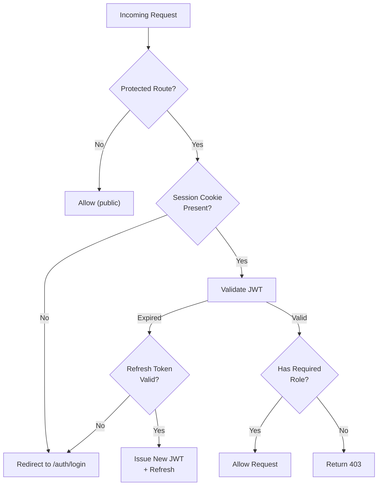

# Architecture 06: Authentication Architecture

## Purpose
Define how users authenticate, how sessions are managed, and how tokens flow through the system.

## Architecture Flow

```mermaid
sequenceDiagram
    participant User
    participant Browser
    participant NextAuth
    participant DB as PostgreSQL
    participant Google
    
    rect rgb(30, 30, 40)
        Note over User,Google: Email/Password Registration
        User->>Browser: Fill registration form
        Browser->>NextAuth: POST /api/auth/register
        NextAuth->>NextAuth: Validate input (Zod)
        NextAuth->>DB: Check email uniqueness
        NextAuth->>NextAuth: Hash password (bcrypt, cost 12)
        NextAuth->>DB: Create user record
        Note over NextAuth: Generate 6-digit verification code
        NextAuth->>DB: Store verification code hash
        NextAuth->>Browser: Return user + show verification code on-screen
        User->>Browser: Enter verification code
        Browser->>NextAuth: POST /api/auth/verify-email
        NextAuth->>DB: Verify code hash
        NextAuth->>DB: Mark emailVerified: true
        NextAuth->>Browser: Set session cookie
    end
    
    rect rgb(40, 30, 30)
        Note over User,Google: Login
        User->>Browser: Enter credentials
        Browser->>NextAuth: POST /api/auth/login
        NextAuth->>DB: Find user by email
        NextAuth->>NextAuth: Compare password hash
        Note over NextAuth: Generate JWT (15min access + 7d refresh)
        NextAuth->>Browser: Set HTTP-only cookie + redirect
    end
    
    rect rgb(30, 40, 30)
        Note over User,Google: Google OAuth
        User->>Browser: Click "Continue with Google"
        Browser->>Google: Redirect to OAuth consent
        Google->>Browser: Authorization code
        Browser->>NextAuth: POST /api/auth/callback/google
        NextAuth->>Google: Exchange code for tokens
        NextAuth->>DB: Find or create user by email
        NextAuth->>Browser: Set session cookie + redirect
    end
```



## Session Token Structure

```typescript
// JWT Payload
interface JammingSessionToken {
  sub: string;           // User UUID
  email: string;
  role: 'USER' | 'ORGANIZER' | 'CO_ORGANIZER' | 'ADMIN';
  name: string;
  iat: number;           // Issued at (epoch)
  exp: number;           // Expiry (epoch, 15 minutes)
}

// Refresh token stored in database or HTTP-only cookie (7 days)
```

## Cookie Configuration

```typescript
const sessionCookie = {
  name: 'jamming.session-token',
  options: {
    httpOnly: true,       // Not accessible via JavaScript
    sameSite: 'lax',      // CSRF protection
    path: '/',
    secure: process.env.NODE_ENV === 'production',
    maxAge: 7 * 24 * 60 * 60, // 7 days in seconds
  },
};
```

## Session Validation Flow



## Components

| Component | Purpose |
|-----------|---------|
| NextAuth.js | Auth framework — session management, OAuth, callbacks |
| Prisma User model | User persistence, password hashing |
| bcrypt (cost 12) | Password hashing |
| JWT (HS256) | Stateless session tokens |
| Zod schemas | Input validation for all auth endpoints |

## Risks

| Risk | Mitigation |
|------|-----------|
| JWT secret compromise | Rotate `NEXTAUTH_SECRET`, force re-login for all users |
| Brute force attacks | Rate limiting (5 attempts / 15 min per IP), progressive delay |
| Session fixation | Regenerate session on login; invalidate on password change |
| OAuth token leak | Use PKCE flow; validate state parameter |
