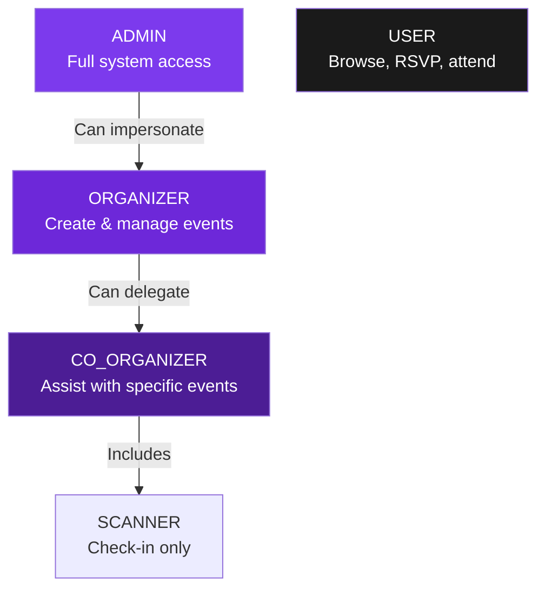
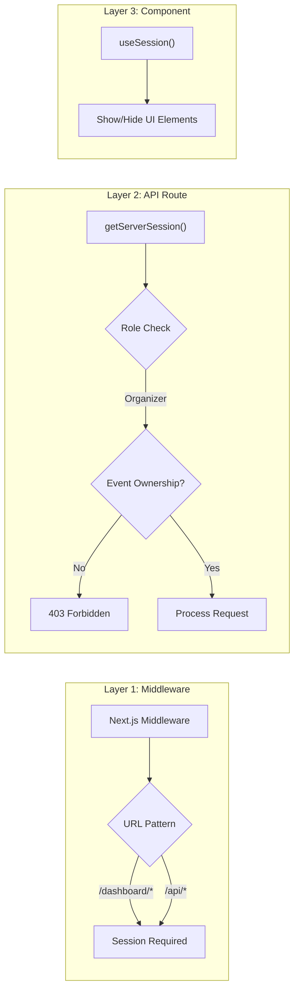

# Architecture 07: Authorization (RBAC) Architecture

## Purpose
Define how role-based access control works across the application — who can access what, and how permissions are enforced.

## Role Hierarchy



## Permission Matrix

| Action | Visitor | USER | ORGANIZER | CO_ORGANIZER | ADMIN |
|--------|---------|------|-----------|--------------|-------|
| Browse events | ✅ | ✅ | ✅ | ✅ | ✅ |
| View event details | ✅ | ✅ | ✅ | ✅ | ✅ |
| Register | ✅ | ❌ | ❌ | ❌ | ❌ |
| Login | ✅ | ❌ | ❌ | ❌ | ❌ |
| RSVP free event | ❌ | ✅ | ✅ | ✅ | ✅ |
| Purchase paid ticket | ❌ | ✅ | ✅ | ✅ | ✅ |
| View own tickets | ❌ | ✅ | ✅ | ✅ | ✅ |
| Cancel own ticket | ❌ | ✅ | ✅ | ✅ | ✅ |
| Create event | ❌ | ❌ | ✅ | ❌ | ✅ |
| Edit own event | ❌ | ❌ | ✅ | ✅ (assigned) | ✅ |
| Cancel own event | ❌ | ❌ | ✅ | ❌ | ✅ |
| View attendee list | ❌ | ❌ | ✅ (own) | ✅ (assigned) | ✅ |
| Scan tickets | ❌ | ❌ | ✅ (own) | ✅ (assigned) | ✅ |
| View dashboard analytics | ❌ | ❌ | ✅ | ❌ | ✅ |
| Manage users | ❌ | ❌ | ❌ | ❌ | ✅ |
| Manage platform settings | ❌ | ❌ | ❌ | ❌ | ✅ |

## Permission Enforcement Layers



## Implementation

### Middleware Protection

```typescript
// src/middleware.ts
export { default } from 'next-auth/middleware';

export const config = {
  matcher: [
    '/tickets/:path*',
    '/dashboard/:path*',
    '/profile/:path*',
    '/api/tickets/:path*',
    '/api/checkin/:path*',
    '/api/events/:path*',  // Only write operations (checked in handler)
    '/api/notifications/:path*',
  ],
};
```

### API Route Protection

```typescript
// Shared authorization helper
export async function requireAuth(req: Request) {
  const session = await getServerSession(authOptions);
  if (!session) {
    throw new AuthError('Unauthorized', 401);
  }
  return session;
}

export async function requireOrganizer(eventId: string, userId: string) {
  const event = await prisma.event.findUnique({ where: { id: eventId } });
  if (!event) throw new AuthError('Not found', 404);
  
  const isOrganizer = event.organizerId === userId;
  const isCoOrganizer = await prisma.eventOrganizer.findUnique({
    where: { eventId_userId: { eventId, userId } },
  });
  
  if (!isOrganizer && !isCoOrganizer) {
    throw new AuthError('Forbidden', 403);
  }
  
  return event;
}
```

### UI-Level Role Checking

```tsx
function DashboardSidebar() {
  const { data: session } = useSession();
  
  return (
    <nav>
      <NavItem href="/dashboard/events" label="My Events" />
      {session?.user?.role === 'ORGANIZER' && (
        <NavItem href="/dashboard/analytics" label="Analytics" />
      )}
      {session?.user?.role === 'ADMIN' && (
        <NavItem href="/admin" label="Admin Panel" />
      )}
    </nav>
  );
}
```

## Co-Organizer Permission Model

Co-organizers in the `EventOrganizer` join table can have two roles:

| Role | Permissions |
|------|-------------|
| `CO_ORGANIZER` | View attendees, scan tickets, view stats, edit event details |
| `SCANNER` | Scan tickets only (check-in duty) |

Both roles are **event-scoped** — they only apply to the specific event they're assigned to.

## Advantages

- **Simple** — Four roles are easy to reason about
- **Event-scoped** — Co-organizers don't get global permissions
- **Layered** — Middleware + API + UI checks provide defense in depth
- **Auditable** — All permission checks are logged via the AuditLog

## Risks

| Risk | Mitigation |
|------|-----------|
| Permission escalation | Audit logging on role changes; admin-only role assignment |
| Session role stale | Always read fresh from database on critical operations |
