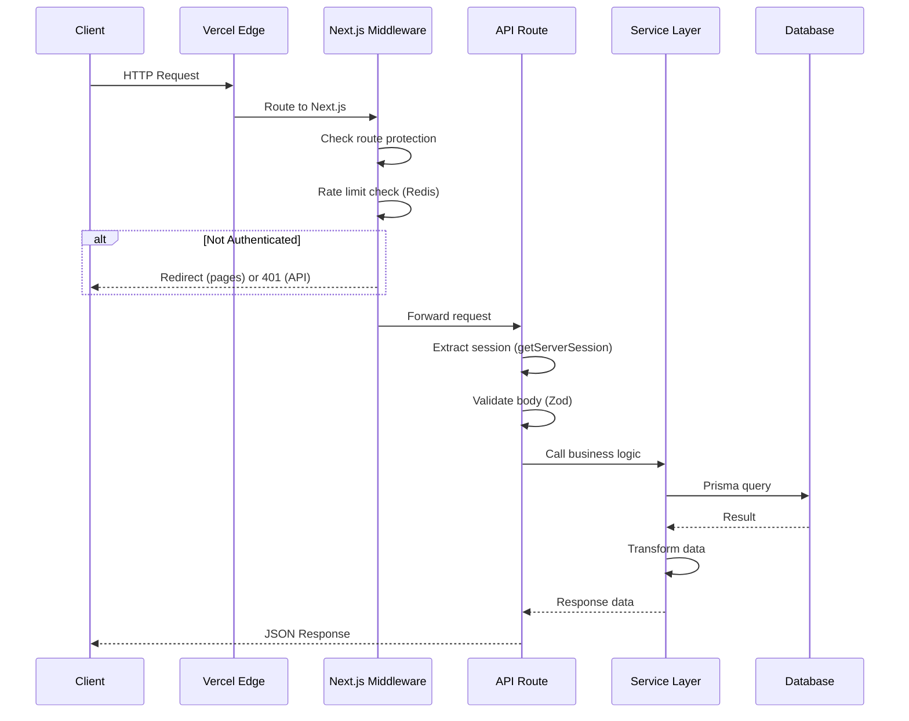
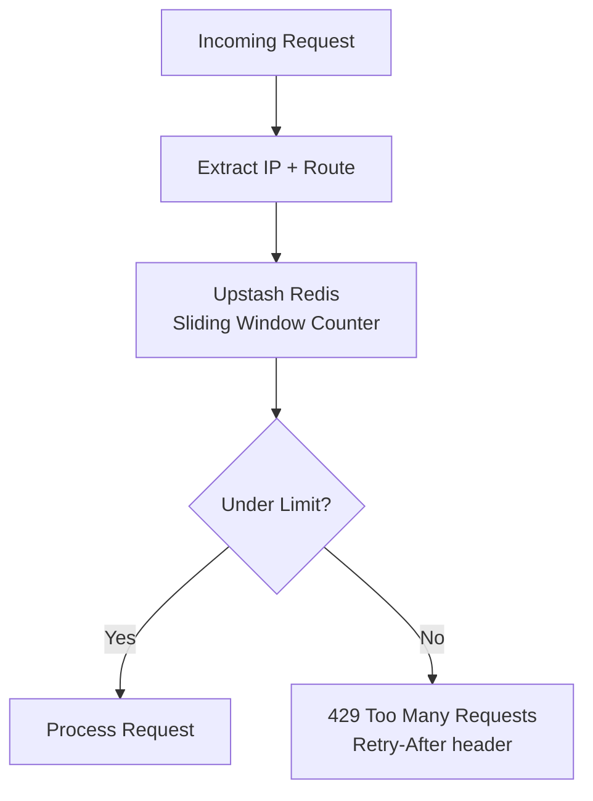

# Architecture 08: API Architecture

## Purpose
Define how the API is structured, how requests flow, and how errors are handled consistently.

## API Design Principles

1. **RESTful** — Resource-oriented endpoints under `/api/*`
2. **Consistent responses** — Every endpoint returns the same response shape
3. **Input validation** — Zod validation on every mutation endpoint
4. **Versioned implicitly** — v1 is default, breaking changes get path prefix `/api/v2`
5. **Stateless** — No server-side session state; JWT handles auth

## Request Flow



## Response Format

### Success

```typescript
{
  success: true,
  data: { ... },                              // Payload
  meta?: { page: number, pageSize: number, total: number }  // Pagination
}
```

### Error

```typescript
{
  success: false,
  error: {
    code: string,                              // Machine-readable error code
    message: string,                           // Human-readable message
    details?: Record<string, string[]>         // Field-level validation errors
  }
}
```

## Error Code Catalog

| Code | HTTP Status | When |
|------|-------------|------|
| `validation_error` | 400 | Input validation failed |
| `unauthorized` | 401 | Not authenticated |
| `forbidden` | 403 | Insufficient permissions |
| `not_found` | 404 | Resource not found |
| `conflict` | 409 | Resource already exists (e.g., duplicate RSVP) |
| `event_full` | 409 | Event at capacity |
| `rate_limited` | 429 | Too many requests |
| `internal_error` | 500 | Unexpected server error |
| `payment_required` | 402 | Payment needed (Phase 2) |
| `blockchain_error` | 502 | Blockchain verification failed (Phase 2) |

## API Route Map

| Module | Base Path | Phase |
|--------|-----------|-------|
| Auth | `/api/auth/*` | 1 |
| Events | `/api/events/*` | 1 |
| Tickets | `/api/tickets/*` | 1 |
| Check-In | `/api/checkin` | 1 |
| Users | `/api/users/*` | 1 |
| Notifications | `/api/notifications/*` | 1 |
| Payments | `/api/payments/*` | 2 |
| Blockchain | `/api/tickets/[id]/verify` | 2 |

## Endpoint Specification

### Events

| Method | Endpoint | Auth | Rate Limit |
|--------|----------|------|------------|
| GET | `/api/events` | No | 1000/15min |
| GET | `/api/events/[id]` | No | 1000/15min |
| POST | `/api/events` | Organizer | 20/1hr |
| PATCH | `/api/events/[id]` | Owner | 20/1hr |
| DELETE | `/api/events/[id]` | Owner | 20/1hr |
| GET | `/api/events/[id]/attendees` | Owner | 100/15min |
| GET | `/api/events/[id]/stats` | Owner | 100/15min |
| POST | `/api/events/[id]/tickets` | User | 30/1hr |
| POST | `/api/events/[id]/waitlist` | User | 30/1hr |
| DELETE | `/api/events/[id]/waitlist` | User | 30/1hr |
| GET | `/api/events/[id]/waitlist` | Owner | 100/15min |

### Tickets

| Method | Endpoint | Auth | Rate Limit |
|--------|----------|------|------------|
| GET | `/api/tickets` | User | 100/15min |
| GET | `/api/tickets/[id]` | User (own) | 100/15min |
| DELETE | `/api/tickets/[id]` | User (own) | 10/1hr |

### Check-In

| Method | Endpoint | Auth | Rate Limit |
|--------|----------|------|------------|
| POST | `/api/checkin` | Scanner | 100/1min |
| GET | `/api/events/[id]/checkins` | Owner | 100/15min |
| GET | `/api/events/[id]/checkins/stats` | Owner | 100/15min |

### Auth

| Method | Endpoint | Auth | Rate Limit |
|--------|----------|------|------------|
| POST | `/api/auth/register` | No | 10/15min |
| POST | `/api/auth/login` | No | 10/15min |
| POST | `/api/auth/logout` | User | 10/15min |
| GET | `/api/auth/session` | No | 100/15min |
| POST | `/api/auth/verify-email` | User | 10/15min |
| POST | `/api/auth/forgot-password` | No | 3/15min |
| POST | `/api/auth/reset-password` | No | 3/15min |

## Rate Limiting Architecture



## Advantages

- **Predictable** — Every endpoint follows the same pattern
- **Self-documenting** — Zod schemas define the contract
- **Rate limited** — Prevents abuse at all layers
- **Stateless** — Scales horizontally with no session affinity

## Risks

| Risk | Mitigation |
|------|-----------|
| Rate limiting false positives | Higher limits for general endpoints; whitelist for organizers |
| Zod validation performance | Simple schemas; no heavy computation in validators |
