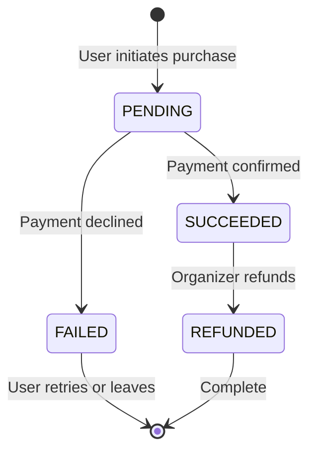
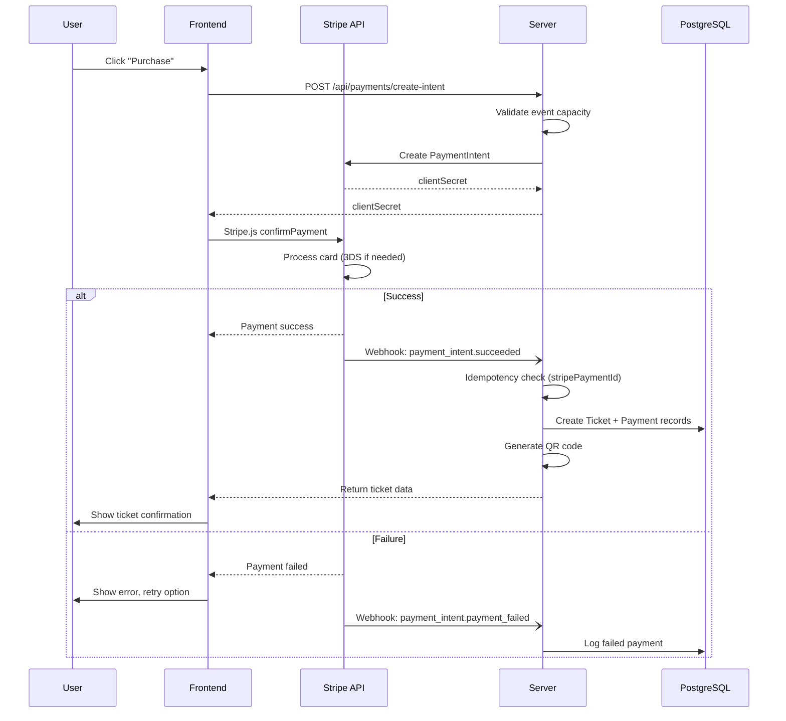

# Architecture 09: Payment Lifecycle Architecture

## Purpose
Define how payments flow through the system, how Stripe is integrated, and how payment state is managed.

## Lifecycle States



## Sequence Flow



## Stripe Integration

```typescript
// Payment Intent Creation
async function createPaymentIntent(amount: number, eventId: string, userId: string) {
  const paymentIntent = await stripe.paymentIntents.create({
    amount: Math.round(amount * 100), // Convert to cents
    currency: 'usd',
    metadata: { eventId, userId },
    automatic_payment_methods: { enabled: true },
    idempotencyKey: `${userId}-${eventId}-${Date.now()}`,
  });
  return { clientSecret: paymentIntent.client_secret };
}
```

## Idempotency Strategy

| Scenario | Key | Behavior |
|----------|-----|----------|
| Double charge prevention | `userId-eventId-timestamp` | Reject duplicate within 24h |
| Webhook redelivery | `stripePaymentId` (unique index) | Skip if already processed |
| User retry | New idempotency key | Allow new attempt |

## Refund Policy Implementation

```typescript
async function handleRefund(ticketId: string, requestedBy: string) {
  const ticket = await prisma.ticket.findUnique({ where: { id: ticketId }, include: { event: true, payment: true } });
  
  // Check refund window (> 24h before event)
  const eventStart = new Date(`${ticket.event.startDate}T${ticket.event.startTime}`);
  const hoursUntilEvent = (eventStart.getTime() - Date.now()) / (1000 * 60 * 60);
  
  if (hoursUntilEvent < 24) {
    throw new Error('Refund window closed (less than 24 hours before event)');
  }
  
  // Process Stripe refund
  const refund = await stripe.refunds.create({
    payment_intent: ticket.payment.stripePaymentId,
  });
  
  // Update records
  await prisma.$transaction([
    prisma.ticket.update({ where: { id: ticketId }, data: { status: 'REFUNDED', refundedAt: new Date() } }),
    prisma.payment.update({ where: { ticketId }, data: { status: 'REFUNDED' } }),
  ]);
}
```

## Components

| Component | Purpose |
|-----------|---------|
| Stripe SDK | Payment processing |
| Payment model | Payment state persistence |
| Webhook handler | Asynchronous payment confirmation |
| Idempotency checks | Prevent duplicate processing |

## Advantages

- **PCI compliant** — Card data never touches our servers
- **Asynchronous** — Webhooks handle confirmation, not blocking the user
- **Idempotent** — Safe against duplicate webhook deliveries
- **Auditable** — Every payment state change is logged

## Risks

| Risk | Mitigation |
|------|-----------|
| Stripe webhook delivery delay | User sees "Processing" state; ticket is reserved pending confirmation |
| Refund race conditions | Database transactions protect against double refunds |
| Payment intent expiry (30min) | Cleanup job cancels stale intents and releases tickets |
