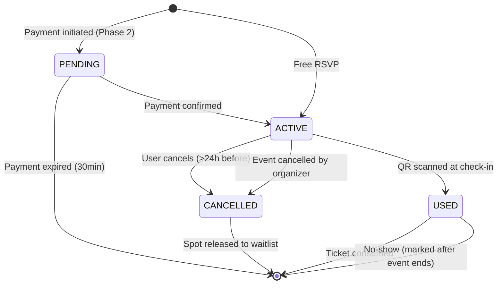
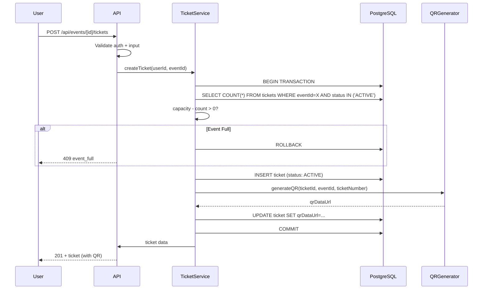

# Architecture 10: Ticket Lifecycle Architecture

## Purpose
Define how tickets are created, used, cancelled, and refunded through their complete lifecycle.

## State Machine



## Ticket Creation Flow



## Race Condition Prevention

```sql
-- Atomic capacity check using row-level locking
BEGIN;
  SELECT id FROM events WHERE id = :eventId
  FOR UPDATE;  -- Lock event row
  
  -- Count active tickets
  SELECT COUNT(*) as count FROM tickets
  WHERE event_id = :eventId AND status IN ('ACTIVE', 'PENDING');
  
  IF count < event.capacity THEN
    INSERT INTO tickets (...) VALUES (...);
    COMMIT;
    RETURN success;
  ELSE
    ROLLBACK;
    RETURN 'event_full';
  END IF;
END;
```

## Ticket Number Generation

```typescript
// Sequential, zero-padded, year-scoped
// Format: JAM-2026-00001
// Implementation uses a database sequence that resets yearly

async function generateTicketNumber(): Promise<string> {
  const year = new Date().getFullYear();
  
  // Atomic increment using a counter table
  const counter = await prisma.ticketCounter.upsert({
    where: { year },
    create: { year, sequence: 1 },
    update: { sequence: { increment: 1 } },
  });
  
  return `JAM-${year}-${String(counter.sequence).padStart(5, '0')}`;
}
```

## Ticket Actions by State

| State | View | Download | Cancel | Refund | Transfer | Scan |
|-------|------|----------|--------|--------|----------|------|
| PENDING | ✅ | ❌ | ❌ | ❌ | ❌ | ❌ |
| ACTIVE | ✅ | ✅ | ✅ (24h+) | ❌ | ❌ (Phase 3) | ✅ |
| USED | ✅ | ✅ | ❌ | ❌ | ❌ | Shows "Used" |
| CANCELLED | ✅ | ❌ | ❌ | ❌ | ❌ | Shows "Cancelled" |
| REFUNDED | ✅ | ❌ | ❌ | ❌ | ❌ | Shows "Refunded" |

## Cleanup Policy

```typescript
// Cron job: run daily at 3 AM
async function cleanupStaleTickets() {
  const now = new Date();
  
  // Expire pending payments > 30 minutes
  await prisma.ticket.updateMany({
    where: { status: 'PENDING', purchasedAt: { lt: new Date(now.getTime() - 30 * 60 * 1000) } },
    data: { status: 'CANCELLED' },
  });
  
  // Archive completed events (90 days after)
  await prisma.ticket.updateMany({
    where: { event: { status: 'COMPLETED', startDate: { lt: new Date(now.getTime() - 90 * 24 * 60 * 60 * 1000) } } },
    data: { /* archive fields */ },
  });
  
  // Mark no-shows (24h after event end)
  await prisma.ticket.updateMany({
    where: { status: 'ACTIVE', event: { status: 'COMPLETED', startDate: { lt: new Date(now.getTime() - 24 * 60 * 60 * 1000) } } },
    data: { status: 'USED' }, // Mark as used with "no-show" metadata
  });
}
```

## Components

| Component | Purpose |
|-----------|---------|
| TicketService | Core ticket business logic (creation, cancellation, verification) |
| QRService | QR generation and signature |
| BlockchainService | Hash generation and on-chain storage (Phase 2) |
| AuditService | Log all ticket state changes |

## Risks

| Risk | Mitigation |
|------|-----------|
| Race condition on last ticket | Row-level locking (`FOR UPDATE`) on event row |
| Ticket number collision | Database unique constraint + atomic counter |
| QR code forgery | HMAC-SHA256 signature in QR payload |
