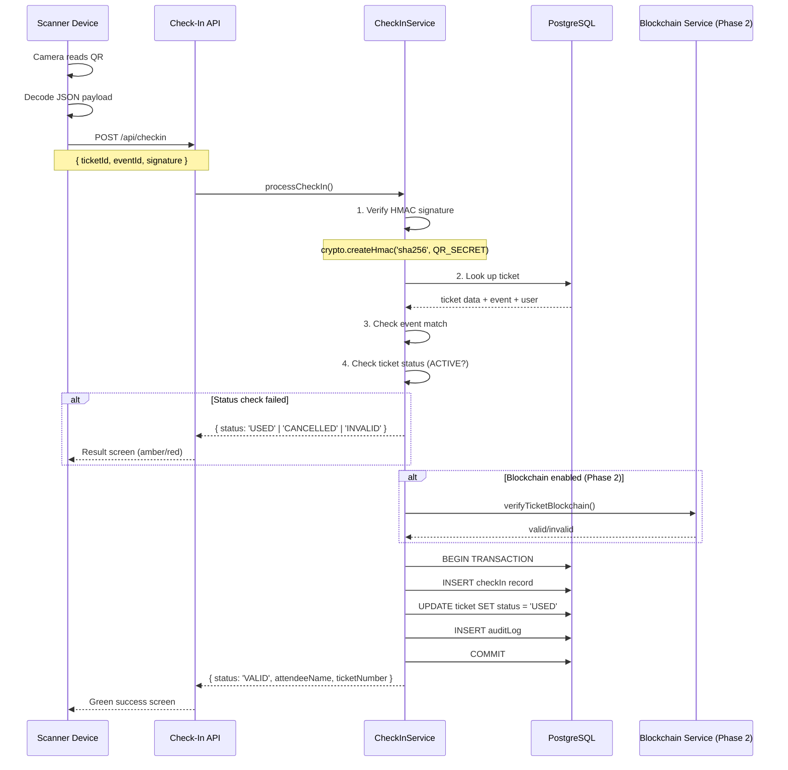

# Architecture 11: QR Verification Architecture

## Purpose
Define how QR codes are generated, how scanning works, and how ticket verification is performed.

## QR Code Payload

```typescript
interface QRPayload {
  ticketId: string;       // UUID (36 chars)
  ticketNumber: string;   // JAM-2026-00042 (15 chars)
  eventId: string;        // UUID (36 chars)
  sig: string;            // HMAC-SHA256 truncated to 16 chars hex (16 chars)
}
// Total payload: ~130 bytes → fits in QR version 3 (29x29 modules)
```

## Verification Flow



## Signature Verification

```typescript
function verifyTicketSignature(ticketId: string, eventId: string, ticketNumber: string, signature: string): boolean {
  const expected = crypto
    .createHmac('sha256', process.env.QR_SECRET_KEY!)
    .update(`${ticketId}:${eventId}:${ticketNumber}`)
    .digest('hex')
    .substring(0, 16);
  
  // Timing-safe comparison to prevent timing attacks
  return crypto.timingSafeEqual(Buffer.from(signature), Buffer.from(expected));
}
```

## Offline Verification Strategy

| Mode | Mechanism | Sync |
|------|-----------|------|
| Online | Real-time API verification | Instant |
| Intermittent | Cache last-known state, optimistic verify | Background sync |
| Offline (PWA) | Pre-downloaded event data + local HMAC check | Batch sync when online |

## Scanner UI States

| Result | Color | Sound | Auto-Dismiss | Action |
|--------|-------|-------|-------------|--------|
| VALID | Green (#052E16 bg) | Short success beep | 3 seconds | Allow entry |
| USED | Amber (#1C1004 bg) | Warning tone | Manual | Notify door staff |
| INVALID | Red (#1C0505 bg) | Error buzz | Manual | Deny entry |
| CANCELLED | Red (#1C0505 bg) | Error buzz | Manual | Deny entry |
| WRONG_EVENT | Red (#1C0505 bg) | Error buzz | Manual | Direct to correct event |

## Components

| Component | Purpose |
|-----------|---------|
| ScannerView (React) | Camera viewfinder, QR decoding |
| ScanResult (React) | Full-screen result display (green/amber/red) |
| CheckInService | Server-side verification, audit logging |
| QRService | QR generation, HMAC signing |
| ManualEntry (React) | Fallback text input for damaged QR codes |

## Performance Targets

| Metric | Target |
|--------|--------|
| Scan-to-result time | < 1 second (95th percentile) |
| First-scan success rate | > 95% |
| Concurrent scans | 100 scans/minute per event |

## Risks

| Risk | Mitigation |
|------|-----------|
| QR code damaged | Error correction level M (15% damage tolerance) |
| Poor lighting | Flashlight support, high-contrast QR colors |
| Camera denied | Manual code entry fallback |
| Double scan | Unique check-in constraint (ticketId unique) |
| Forged QR | HMAC signature in payload |
