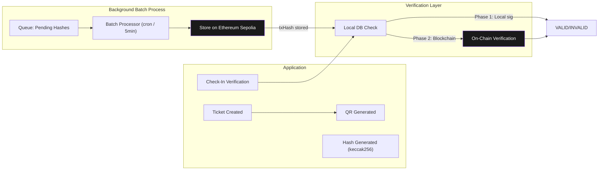

# Architecture 12: Blockchain Integrity Architecture

## Purpose
Define how blockchain is used as a background security layer for ticket integrity — completely invisible to users.

## Philosophy

**Blockchain is a security layer, NOT a product.** Users never:
- See a wallet address
- Pay with cryptocurrency
- Manage private keys
- Sign transactions
- Pay gas fees
- Hear the words "blockchain", "Ethereum", or "smart contract"

## Architecture



## Hash Generation

```typescript
function generateTicketHash(ticketId: string, eventId: string, userId: string): string {
  return ethers.solidityPackedKeccak256(
    ['string', 'string', 'string', 'string', 'uint256'],
    [
      ticketId,
      eventId,
      userId,
      process.env.BLOCKCHAIN_SECRET!,
      Math.floor(Date.now() / 1000)
    ]
  );
}
```

## Smart Contract (Minimal)

```solidity
// SPDX-License-Identifier: MIT
pragma solidity ^0.8.20;
contract TicketVerification {
    mapping(bytes32 => bool) public verifiedHashes;
    mapping(bytes32 => uint256) public hashTimestamps;
    
    function storeHashes(bytes32[] calldata hashes) external onlyOwner {
        for (uint256 i = 0; i < hashes.length; i++) {
            verifiedHashes[hashes[i]] = true;
            hashTimestamps[hashes[i]] = block.timestamp;
        }
    }
    
    function verifyHash(bytes32 hash) external view returns (bool, uint256) {
        return (verifiedHashes[hash], hashTimestamps[hash]);
    }
}
```

## Batch Processing

| Interval | Action | Cost per 100 tickets |
|----------|--------|---------------------|
| Every 5 minutes | Process pending hashes | ~420,000 gas (~80% savings vs individual) |
| Queue max | 50 hashes per batch | ~235,000 gas |
| Fallback | Immediate store on demand | Individual tx cost |

## Fallback Strategy

| Scenario | Behavior |
|----------|----------|
| Blockchain unavailable | Local database verification (HMAC signature) |
| RPC failure | Queue transactions, retry on next interval |
| Smart contract failure | Pause contract, deploy fix, re-submit hashes |

## Components

| Component | Purpose |
|-----------|---------|
| BlockchainService | Hash generation, batch storage, verification |
| BatchProcessor | Cron job for pending hashes |
| Smart Contract | On-chain hash storage + verification |

## Cost Estimates (Sepolia)

| Item | Cost |
|------|------|
| Deploy contract | ~$0.50 |
| Per ticket (batch) | ~$0.0024 |
| Monthly (1,000 tickets) | ~$2.40 |

## Risks

| Risk | Mitigation |
|------|-----------|
| Private key compromise | Hardware wallet, limited ETH balance, key rotation |
| Gas price spikes | Batch during low-gas periods, max price config |
| Reorg attacks | Wait 12 confirmations (~3 min) before confirming |
