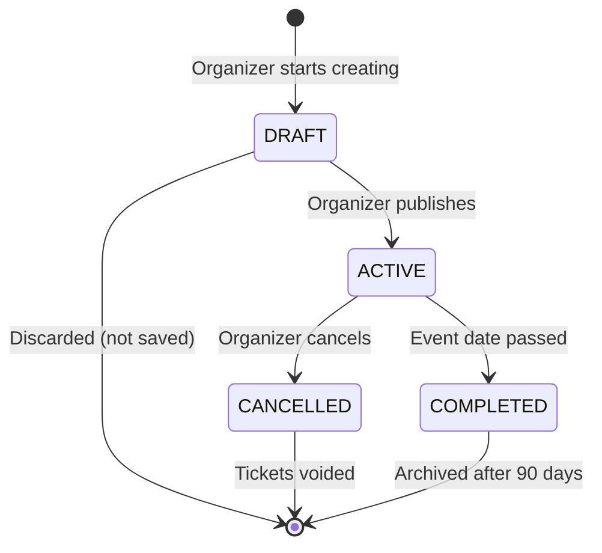
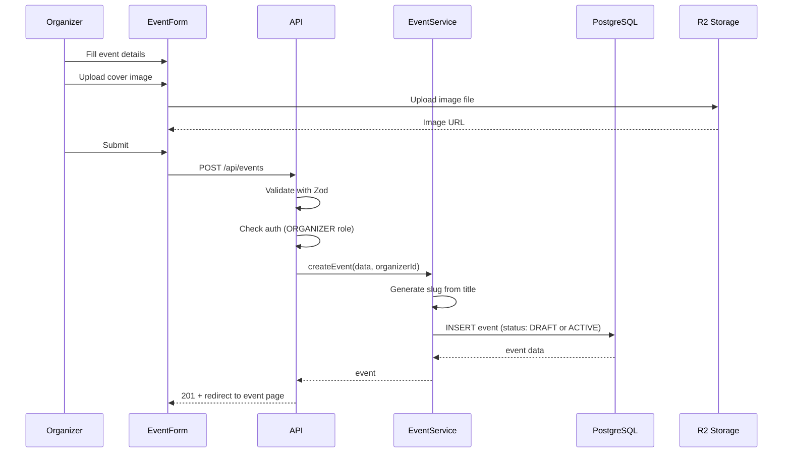

# Architecture 13: Event Lifecycle Architecture

## Purpose
Define how events are created, managed, and completed through their lifecycle.

## State Machine



## Event Creation Flow



## Event Capacity Management

```sql
-- Available spots calculation
SELECT 
  e.capacity,
  COUNT(t.id) FILTER (WHERE t.status IN ('ACTIVE', 'PENDING')) as booked,
  e.capacity - COUNT(t.id) FILTER (WHERE t.status IN ('ACTIVE', 'PENDING')) as available,
  COUNT(w.id) FILTER (WHERE w.status = 'WAITING') as waitlist_count
FROM events e
LEFT JOIN tickets t ON t.event_id = e.id
LEFT JOIN waitlist_entries w ON w.event_id = e.id AND w.status = 'WAITING'
WHERE e.id = :eventId
GROUP BY e.id;
```

## Cancellation Flow

```typescript
async function cancelEvent(eventId: string, organizerId: string) {
  return await prisma.$transaction(async (tx) => {
    const event = await tx.event.findUnique({ where: { id: eventId } });
    
    // 1. Mark event as cancelled
    await tx.event.update({ where: { id: eventId }, data: { status: 'CANCELLED' } });
    
    // 2. Void all active tickets
    const tickets = await tx.ticket.updateMany({
      where: { eventId, status: 'ACTIVE' },
      data: { status: 'CANCELLED', cancelledAt: new Date() },
    });
    
    // 3. Clear waitlist
    await tx.waitlistEntry.updateMany({
      where: { eventId, status: 'WAITING' },
      data: { status: 'EXPIRED' },
    });
    
    // 4. Cancel payments (Phase 2)
    // await refundAllPayments(tx, eventId);
    
    // 5. Notify all ticket holders
    // (Handled by notification service)
    
    // 6. Audit log
    await tx.auditLog.create({
      data: {
        action: 'event.cancelled',
        entityType: 'event',
        entityId: eventId,
        actorId: organizerId,
        metadata: { ticketsVoided: tickets.count },
      },
    });
    
    return event;
  });
}
```

## Components

| Component | Purpose |
|-----------|---------|
| EventService | Event CRUD, capacity management, cancellation |
| EventForm | Validation, image upload, status management |
| WaitlistService | Waitlist joint/leave/promote |
| NotificationService | Event change notifications |

## Timelines

| Action | Timing |
|--------|--------|
| Event creation | Instant |
| Publish from draft | Instant |
| RSVP opens | Immediately after publish |
| RSVP closes | At event start time |
| Cancellation cutoff | Any time before event |
| Post-event cleanup | 24h after event end (no-show marking) |
| Archival | 90 days after event completion |
