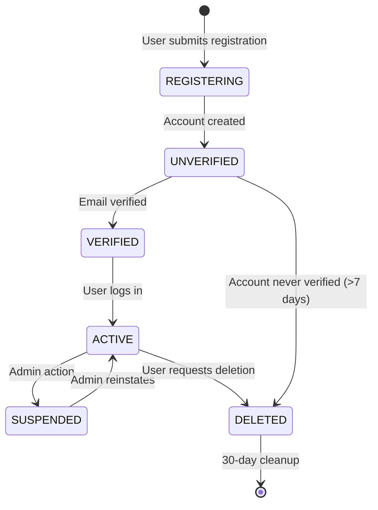
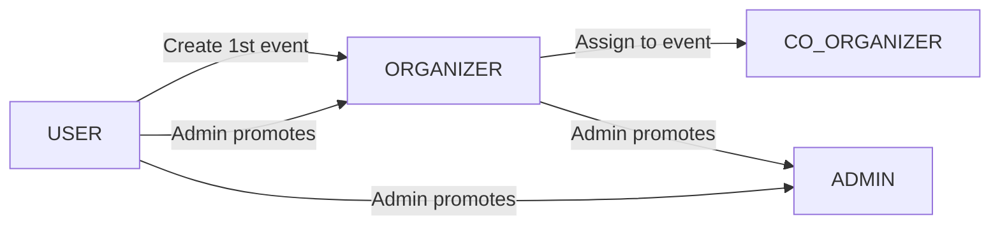

# Architecture 14: User Lifecycle Architecture

## Purpose
Define how user accounts are created, managed, and deleted through their lifecycle.

## State Machine



## Registration Flow

```typescript
async function registerUser(email: string, password: string, displayName: string) {
  // 1. Validate input (Zod)
  // 2. Check email uniqueness
  const existing = await prisma.user.findUnique({ where: { email } });
  if (existing) throw new ApiError('Email already registered', 409);
  
  // 3. Hash password
  const passwordHash = await bcrypt.hash(password, 12);
  
  // 4. Create user
  const user = await prisma.user.create({
    data: { email, passwordHash, displayName, role: 'USER' },
  });
  
  // 5. Generate verification code
  const code = generateVerificationCode(); // 6 digits
  await prisma.verificationToken.create({
    data: {
      identifier: email,
      token: await bcrypt.hash(code, 6), // Store hash
      expires: new Date(Date.now() + 24 * 60 * 60 * 1000), // 24h
    },
  });
  
  // 6. Return user + display verification code (Phase 1: in-app)
  // Phase 2: send email instead
  return { user, verificationCode: code };
}
```

## Account Deletion Flow

```typescript
async function deleteAccount(userId: string) {
  // 1. Anonymize personal data
  await prisma.user.update({
    where: { id: userId },
    data: {
      displayName: 'Deleted User',
      email: `deleted-${userId}@anonymous.jamming.com`,
      passwordHash: null,
      avatarUrl: null,
      bio: null,
      instruments: [],
    },
  });
  
  // 2. Schedule hard deletion (30 days)
  await prisma.deletionSchedule.create({
    data: { userId, deleteAt: new Date(Date.now() + 30 * 24 * 60 * 60 * 1000) },
  });
}
```

## User-to-Role Promotion



| Action | Trigger | Role Change |
|--------|---------|-------------|
| Create an event | First event published | USER → ORGANIZER |
| Admin promotion | Admin panel | USER → ORGANIZER |
| Assign to event | Organizer assigns co-organizer | USER → CO_ORGANIZER (event-scoped) |
| Admin promotion | Admin panel | ORGANIZER → ADMIN |

## Components

| Component | Purpose |
|-----------|---------|
| AuthService | Registration, login, password management |
| UserService | Profile management, preferences, deletion |
| VerificationService | Email verification (Phase 1: in-app, Phase 2: email) |
| CleanupJob | Account deletion schedule, data retention |

## Data Retention

| Data | Retention | Action |
|------|-----------|--------|
| Active account | Indefinite | - |
| Deleted account | 30 days | Hard delete all PII |
| Unverified account | 7 days | Cleanup job removes |
| Audit logs (user actions) | 1 year | Archive to cold storage |
