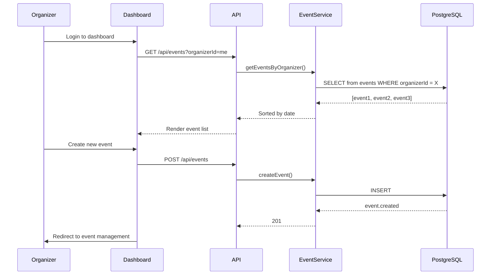
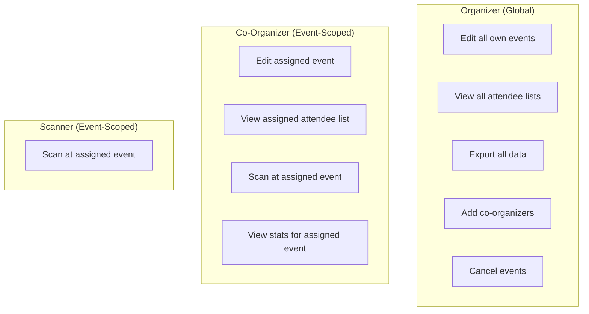

# Architecture 15: Organizer Lifecycle Architecture

## Purpose
Define how organizers manage events, how the dashboard works, and how co-organizer permissions are managed.

## Organizer Journey



## Dashboard Data Model

```typescript
interface DashboardData {
  stats: {
    activeEvents: number;
    totalTickets: number;
    checkedInToday: number;
    revenue?: number; // Phase 2
  };
  events: Array<{
    id: string;
    title: string;
    date: string;
    venue: string;
    capacity: number;
    ticketsSold: number;
    checkedIn: number;
    status: EventStatus;
    waitlistCount: number;
  }>;
}
```

## Co-Organizer Management

```typescript
// Adding a co-organizer
async function addCoOrganizer(eventId: string, userEmail: string, role: 'CO_ORGANIZER' | 'SCANNER') {
  const user = await prisma.user.findUnique({ where: { email: userEmail } });
  if (!user) throw new ApiError('User not found', 404);
  
  await prisma.eventOrganizer.create({
    data: { eventId, userId: user.id, role },
  });
  
  // Notify the user
  await notificationService.sendNotification(user.id, {
    type: 'ASSIGNED_AS_CO_ORGANIZER',
    message: `You've been added as ${role} to an event`,
    link: `/dashboard/events/${eventId}`,
  });
}
```

## Organizer Dashboard Components

| Component | Data Source | Refresh |
|-----------|-------------|---------|
| Stats cards (API) | Events + Tickets + CheckIns | On page load |
| Events list (DB) | Events table | On page load |
| Real-time check-in count (Polling) | CheckIns by event | Every 5 seconds |
| Attendee list (DB) | Tickets + Users | On page load |
| Check-in scanner (Camera) | Client-side | Real-time |

## Role Scoping



## Risks

| Risk | Mitigation |
|------|-----------|
| Organizer creates too many events | Rate limit 20 events/hour |
| Co-organizer exceeds permissions | Enforce permissions in API layer + audit all actions |
| Dashboard data stale | Polling for real-time check-in; TanStack Query caching for other data |
