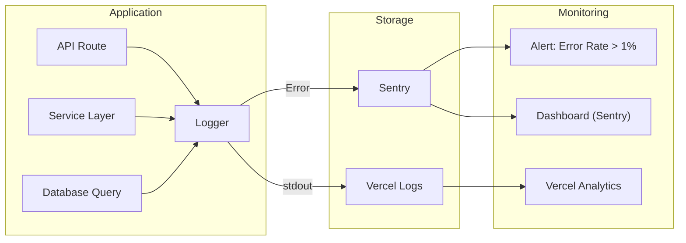

# Architecture 16: Logging Architecture

## Purpose
Define how application logs are structured, stored, and monitored across the system.

## Log Structure

```typescript
interface LogEntry {
  timestamp: string;        // ISO 8601
  level: 'DEBUG' | 'INFO' | 'WARN' | 'ERROR' | 'FATAL';
  correlationId: string;    // UUID, same for entire request
  service: string;          // Service name (e.g., 'checkin-service')
  action: string;           // Action name (e.g., 'checkin.processed')
  message: string;          // Human-readable message
  metadata?: Record<string, unknown>;  // Structured data
  environment: string;      // 'development' | 'staging' | 'production'
  version: string;          // App version
}
```

## Log Flow



## Logger Implementation

```typescript
// Singleton logger configured at startup
import pino from 'pino';

export const logger = pino({
  level: process.env.LOG_LEVEL || 'info',
  transport: process.env.NODE_ENV === 'development'
    ? { target: 'pino-pretty', options: { colorize: true } }
    : undefined,
  serializers: {
    req: (req) => ({ method: req.method, url: req.url }),
    res: (res) => ({ statusCode: res.statusCode }),
    err: pino.stdSerializers.err,
  },
  redact: {
    paths: ['req.headers.authorization', 'req.headers.cookie', 'body.password', 'body.confirmPassword'],
    censor: '[REDACTED]',
  },
});

// Usage
logger.info({ action: 'ticket.created', ticketId, eventId }, 'New ticket created');
logger.warn({ action: 'checkin.slow', durationMs: 1200 }, 'QR verification exceeded target');
logger.error({ err, ticketId }, 'Failed to create ticket');
```

## What to Log by Level

| Level | What |
|-------|------|
| DEBUG | SQL queries, function params (development only) |
| INFO | Normal operations (user registered, ticket created, check-in processed) |
| WARN | Unexpected but handled (rate limit exceeded, retry occurred) |
| ERROR | Failure requiring attention (payment failed, DB connection lost) |
| FATAL | System cannot continue (server crash) |

## PII Redaction

```typescript
// Never log:
const sensitiveFields = [
  'password', 'passwordHash', 'confirmPassword',
  'creditCard', 'cvv', 'cardNumber',
  'accessToken', 'refreshToken', 'secret',
  'authorization', 'cookie',
];

// Always redact these from logs automatically
```

## Components

| Component | Purpose |
|-----------|---------|
| pino | Structured JSON logger |
| Sentry | Error tracking + performance monitoring |
| Vercel Analytics | Web Vitals + traffic analytics |
| Correlation ID middleware | Attach UUID to every request |
