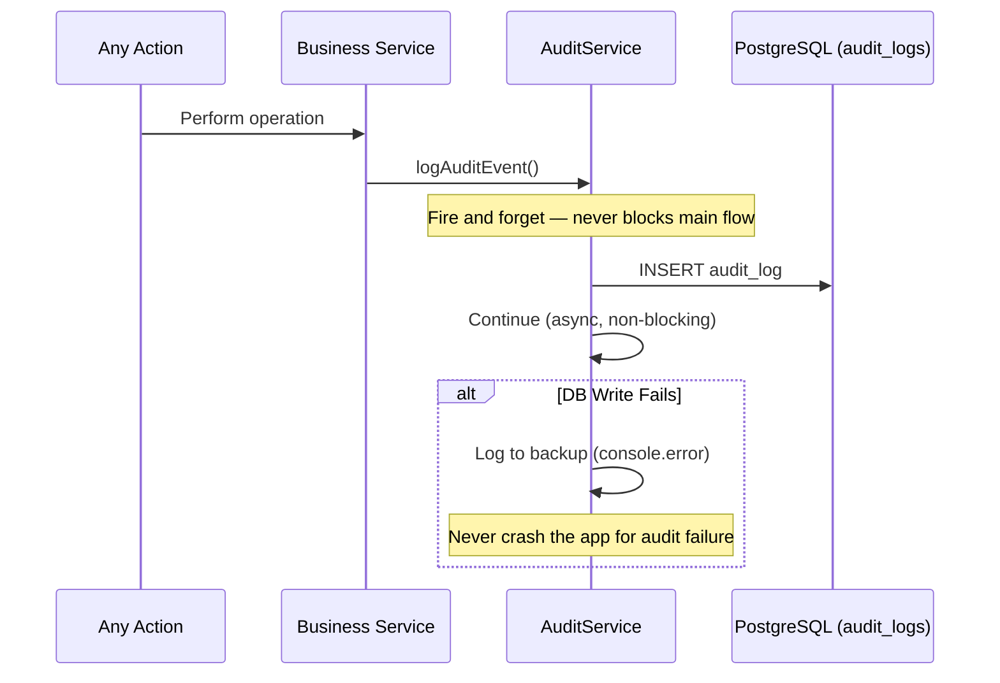

# Architecture 17: Audit Trail Architecture

## Purpose
Define how security-relevant events are recorded in an immutable audit trail for compliance, fraud detection, and incident investigation.

## Audit Events Catalog

| Category | Action | Entity | Triggered By |
|----------|--------|--------|-------------|
| Auth | login.success | user | AuthService |
| Auth | login.failure | user | AuthService |
| Auth | logout | user | AuthService |
| Auth | password.reset | user | AuthService |
| Auth | email.verified | user | AuthService |
| User | registered | user | AuthService |
| User | profile.updated | user | UserService |
| User | deleted | user | UserService |
| Event | created | event | EventService |
| Event | updated | event | EventService |
| Event | cancelled | event | EventService |
| Ticket | created | ticket | TicketService |
| Ticket | cancelled | ticket | TicketService |
| Ticket | refunded | ticket | PaymentService |
| CheckIn | processed | checkin | CheckInService |
| CheckIn | failed | checkin | CheckInService |
| Payment | intent.created | payment | PaymentService |
| Payment | succeeded | payment | PaymentService |
| Payment | failed | payment | PaymentService |
| Blockchain | hash.stored | blockchain | BlockchainService |
| Blockchain | verification | blockchain | CheckInService |
| Admin | role.changed | user | AdminService |
| Admin | user.suspended | user | AdminService |

## Audit Log Flow



## Audit Log Schema

```prisma
model AuditLog {
  id          String   @id @default(uuid()) @db.Uuid
  action      String   // "ticket.created", "checkin.valid", etc.
  entityType  String   // "ticket", "event", "user"
  entityId    String   // UUID of affected entity
  actorId     String?  // UUID of user who performed action
  metadata    Json?    // Action-specific data
  ipAddress   String?
  userAgent   String?
  timestamp   DateTime @default(now())
}
```

## Audit Log Implementation

```typescript
export const audit = {
  async log(event: AuditEvent): Promise<void> {
    try {
      await prisma.auditLog.create({ data: event });
    } catch (error) {
      console.error('Audit log write failed:', error);
    }
  },
  
  // Convenience methods
  ticketCreated: (ticketId, userId, meta) => 
    log({ action: 'ticket.created', entityType: 'ticket', entityId: ticketId, actorId: userId, metadata: meta }),
  
  checkinValid: (ticketId, scannerId, meta) => 
    log({ action: 'checkin.valid', entityType: 'ticket', entityId: ticketId, actorId: scannerId, metadata: meta }),
  
  eventCancelled: (eventId, organizerId, meta) => 
    log({ action: 'event.cancelled', entityType: 'event', entityId: eventId, actorId: organizerId, metadata: meta }),
};
```

## Retention & Archival

| Timeframe | Action | Storage |
|-----------|--------|---------|
| 0-90 days | Active in database | PostgreSQL (audit_logs table) |
| 90-365 days | Archived | Archive table or cold storage |
| 365+ days | Permanent | Archival backup |

## Audit Queries

```sql
-- Fraud investigation: multiple check-in failures for same ticket
SELECT * FROM audit_logs 
WHERE entity_type = 'ticket' AND entity_id = :ticketId
AND action LIKE 'checkin.%'
ORDER BY timestamp DESC;

-- User activity timeline
SELECT * FROM audit_logs 
WHERE actor_id = :userId
ORDER BY timestamp DESC
LIMIT 50;

-- Event audit trail
SELECT * FROM audit_logs 
WHERE entity_type = 'event' AND entity_id = :eventId
ORDER BY timestamp;
```
