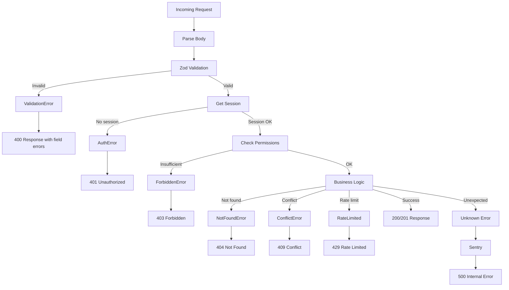

# Architecture 18: Error Handling Architecture

## Purpose
Define a consistent error handling strategy across the entire application — API routes, services, and client-side.

## Error Hierarchy

```typescript
class AppError extends Error {
  constructor(
    public code: string,
    public message: string,
    public statusCode: number = 500,
    public details?: Record<string, string[]>
  ) {
    super(message);
    this.name = 'AppError';
  }
}

class AuthError extends AppError {
  constructor(message: string) {
    super('unauthorized', message, 401);
  }
}

class ForbiddenError extends AppError {
  constructor(message: string) {
    super('forbidden', message, 403);
  }
}

class NotFoundError extends AppError {
  constructor(entity: string) {
    super('not_found', `${entity} not found`, 404);
  }
}

class ConflictError extends AppError {
  constructor(message: string) {
    super('conflict', message, 409);
  }
}

class ValidationError extends AppError {
  constructor(details: Record<string, string[]>) {
    super('validation_error', 'Validation failed', 400, details);
  }
}
```

## Error Flow



## API Route Error Wrapper

```typescript
// Error-handling wrapper for all API routes
async function apiHandler<T>(
  handler: () => Promise<T>,
  req: NextRequest
): Promise<NextResponse> {
  try {
    const result = await handler();
    return NextResponse.json({ success: true, data: result }, { status: 200 });
  } catch (error) {
    // Known application errors
    if (error instanceof AppError) {
      return NextResponse.json(
        {
          success: false,
          error: {
            code: error.code,
            message: error.message,
            details: error.details,
          },
        },
        { status: error.statusCode }
      );
    }
    
    // Zod validation errors
    if (error instanceof z.ZodError) {
      const details: Record<string, string[]> = {};
      error.errors.forEach((e) => {
        const path = e.path.join('.');
        details[path] = details[path] || [];
        details[path].push(e.message);
      });
      return NextResponse.json(
        { success: false, error: { code: 'validation_error', message: 'Validation failed', details } },
        { status: 400 }
      );
    }
    
    // Prisma errors (database)
    if (error instanceof Prisma.PrismaClientKnownRequestError) {
      if (error.code === 'P2002') {
        return NextResponse.json(
          { success: false, error: { code: 'conflict', message: 'Resource already exists' } },
          { status: 409 }
        );
      }
    }
    
    // Unknown errors — log and return generic message
    logger.error({ err: error }, 'Unhandled error in API route');
    return NextResponse.json(
      { success: false, error: { code: 'internal_error', message: 'An unexpected error occurred' } },
      { status: 500 }
    );
  }
}

// Usage
export const POST = (req: NextRequest) => apiHandler(async () => {
  const session = await requireAuth(req);
  const body = await validateBody(req, createEventSchema);
  return eventService.createEvent(body, session.user.id);
}, req);
```

## Client-Side Error Handling

```typescript
// Custom hook for API calls with error handling
function useApiError() {
  const [error, setError] = useState<ApiError | null>(null);
  
  const handleError = useCallback((err: unknown) => {
    if (err instanceof ApiError) {
      setError(err);
      // Show toast for user-actionable errors
      if (err.code === 'event_full') {
        toast.warning('Event is full. Join the waitlist?');
      } else if (err.code === 'validation_error') {
        // Errors are handled by form field components
      }
    } else {
      // Generic error — show toast
      toast.error('Something went wrong. Please try again.');
    }
  }, []);
  
  return { error, handleError, clearError };
}
```

## Error Boundary (React)

```tsx
// Client-side error boundary for component crashes
class ErrorBoundary extends React.Component<Props, State> {
  static getDerivedStateFromError(error: Error) {
    return { hasError: true, error };
  }
  
  componentDidCatch(error: Error, info: React.ErrorInfo) {
    logger.error({ err: error, componentStack: info.componentStack }, 'React component crashed');
  }
  
  render() {
    if (this.state.hasError) {
      return <ErrorFallback error={this.state.error} onReset={() => this.setState({ hasError: false })} />;
    }
    return this.props.children;
  }
}
```
