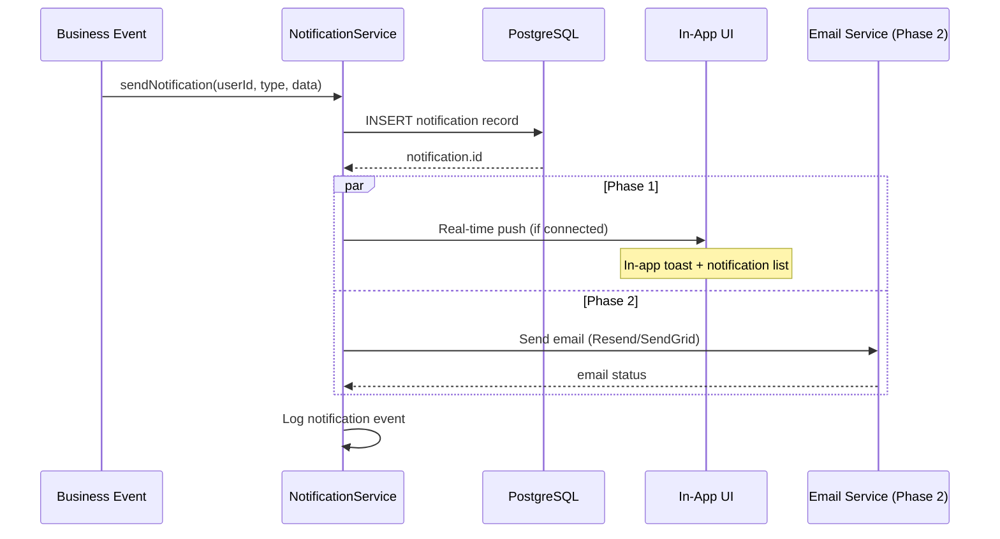

# Architecture 19: Notification Architecture

## Purpose
Define how users are notified of events, ticket confirmations, reminders, and cancellations — both in-app (Phase 1) and email (Phase 2).

## Notification Types

| Type | Phase | Trigger | Delivery |
|------|-------|---------|----------|
| TICKET_CONFIRMATION | 1 | Ticket created | In-app toast + notification list |
| TICKET_CONFIRMATION | 2 | Ticket created | Email + in-app |
| EVENT_REMINDER | 1 | 24h before event | In-app notification list |
| EVENT_REMINDER | 2 | 24h before event | Email + in-app |
| EVENT_CANCELLED | 1 | Event cancelled | In-app notification list |
| EVENT_CANCELLED | 2 | Event cancelled | Email + in-app |
| WAITLIST_PROMOTED | 1 | Spot available | In-app notification list |
| WAITLIST_PROMOTED | 2 | Spot available | Email + in-app |
| CHECK_IN_SUCCESS | 1 | QR scanned | Toast (scanner device) |

## Notification Flow



## In-App Notification System

```typescript
interface NotificationData {
  id: string;
  type: NotificationType;
  title: string;
  message: string;
  read: boolean;
  link?: string; // URL to navigate on click
  createdAt: Date;
}

// Creating a notification
async function createNotification(userId: string, type: NotificationType, data: { title: string; message: string; link?: string }) {
  const notification = await prisma.notification.create({
    data: {
      userId,
      type,
      title: data.title,
      message: data.message,
      link: data.link,
    },
  });
  
  // Real-time delivery (if user is connected via WebSocket/SSE)
  await pushToUser(userId, notification);
  
  return notification;
}
```

## Notification Polling Strategy

```typescript
// Phase 1: Poll every 30 seconds (no real-time infrastructure)
const { data: notifications } = useQuery({
  queryKey: ['notifications'],
  queryFn: () => fetch('/api/notifications'),
  refetchInterval: 30_000, // 30 seconds
});
```

## Components

| Component | Purpose |
|-----------|---------|
| NotificationBell | Header icon with unread count badge |
| NotificationItem | Individual notification display with type icon |
| NotificationCenter | Dropdown panel or full page list |
| NotificationService | Create, mark read, batch mark read |
