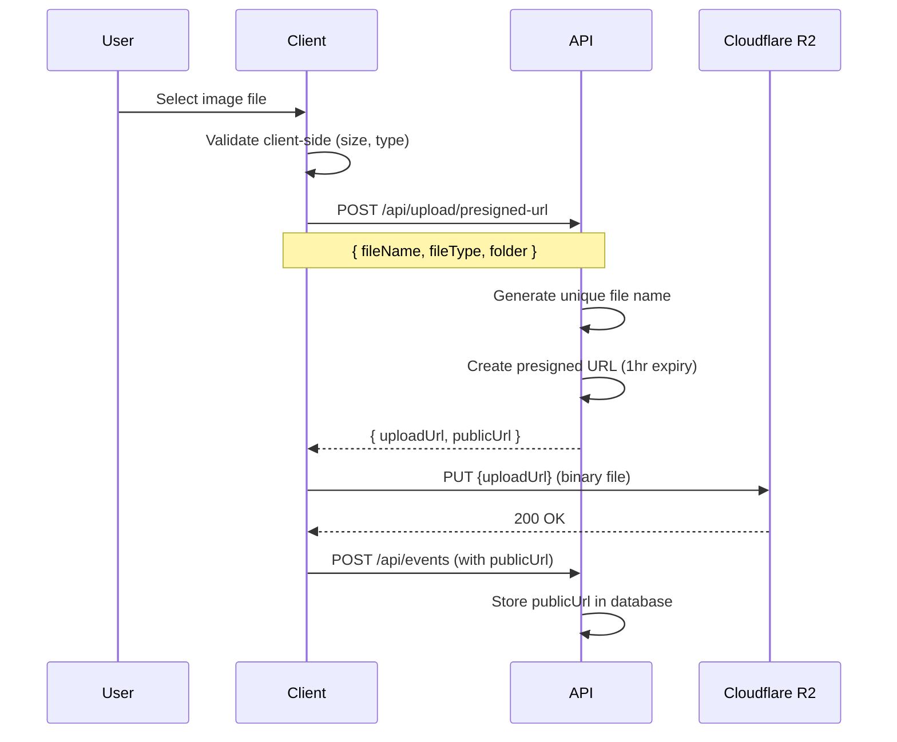

# Architecture 20: File Storage Architecture

## Purpose
Define how files (images, exports) are stored, served, and managed.

## Storage Provider

**Provider:** Cloudflare R2 (S3-compatible, zero egress fees)
**Alternative:** AWS S3 (if R2 unavailable)

## File Types

| Type | Max Size | Allowed Formats | Storage Path | Public |
|------|----------|----------------|--------------|--------|
| Event cover image | 5MB | jpg, png, webp | `/events/{eventId}/cover.{ext}` | ✅ Yes |
| User avatar | 2MB | jpg, png, webp | `/users/{userId}/avatar.{ext}` | ✅ Yes |
| Ticket PDF | 1MB | pdf | `/tickets/{ticketId}/ticket.pdf` | ❌ Signed URL |
| Export CSV | 10MB | csv | `/exports/{userId}/{eventId}.csv` | ❌ Auth required |

## Upload Flow



## Image Optimization

```typescript
// Server-side: Generate optimized variants on upload
const optimizedVariants = [
  { name: 'thumbnail', width: 400, quality: 80 },
  { name: 'medium', width: 800, quality: 85 },
  { name: 'large', width: 1200, quality: 90 },
];

// Client-side: Next.js Image component handles responsive images
<Image
  src={event.coverImageUrl}
  alt={event.title}
  width={800}
  height={400}
  placeholder="blur"
  blurDataURL={event.blurHash} // Tiny placeholder
/>
```

## Security

| Measure | Implementation |
|---------|---------------|
| File type validation | MIME type check on server + client |
| File size limits | Enforced at upload endpoint |
| Malware scanning | Phase 2: ClamAV integration |
| Access control | Signed URLs for private files |
| CORS | Restricted to application origin |

## Cleanup

```typescript
// Cron job: Orphaned file cleanup
async function cleanupOrphanedFiles() {
  // Find images not referenced by any event
  // Find expired export files
  // Delete from R2
}
```

## Components

| Component | Purpose |
|-----------|---------|
| R2 Client | Upload, download, delete operations |
| ImageUploader | React component with preview, crop, drag-drop |
| PresignedUrlService | Generate time-limited upload URLs |
