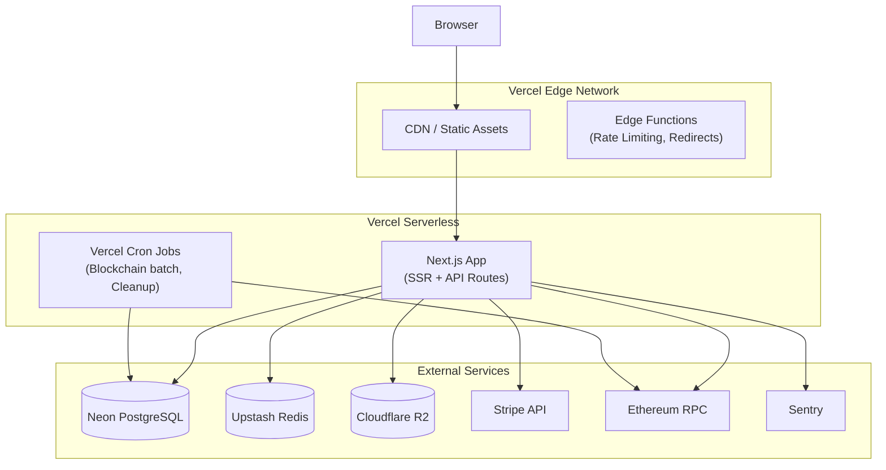
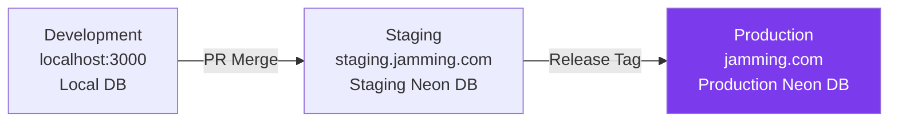

# Architecture 23: Deployment Architecture

## Purpose
Define how the application is deployed, hosted, and made available to users.

## Hosting Diagram



## Environment Promotion



## Deploy Pipeline

```yaml
# .github/workflows/deploy.yml
name: Deploy
on:
  push:
    branches: [main]
  pull_request:
    branches: [main]

jobs:
  test:
    runs-on: ubuntu-latest
    steps:
      - uses: actions/checkout@v4
      - uses: actions/setup-node@v4
      - run: npm ci
      - run: npm run lint
      - run: npm run typecheck
      - run: npm test
      - run: npx playwright install && npm run test:e2e
  
  deploy-staging:
    needs: test
    if: github.event_name == 'pull_request'
    uses: vercel/actions/.github/workflows/deploy.yml@v4
    with:
      environment: staging
  
  deploy-production:
    needs: test
    if: github.event_name == 'push' && github.ref == 'refs/heads/main'
    uses: vercel/actions/.github/workflows/deploy.yml@v4
    with:
      environment: production
    steps:
      - run: npx prisma migrate deploy
```

## Environment Specifications

| Environment | URL | Database | Purpose |
|-------------|-----|----------|---------|
| Development | localhost:3000 | Local PostgreSQL | Daily development |
| Staging | staging.jamming.com | Neon (free tier) | QA + integration testing |
| Production | jamming.com | Neon (scale) | Live users |

## Database Branching Strategy

```bash
# Neon supports database branching
# Each preview deployment gets a branch of the database

# Production branch: main
# Staging branch: staging
# PR branch: pr-123 (auto-created from main)
```

## Domain Configuration

```text
jamming.com          → Vercel (production)
www.jamming.com      → Redirect to jamming.com
staging.jamming.com  → Vercel (staging)

SSL: Automatic via Vercel (Let's Encrypt)
```

## Backup Strategy

| What | Frequency | Retention | Storage |
|------|-----------|-----------|---------|
| Database | Daily | 30 days | Neon built-in |
| Point-in-time | Continuous | 7 days | Neon built-in |
| File storage | Continuous replication | - | R2 automatic |
| Environment variables | Manual snapshot | Per deployment | Vercel dashboard |
