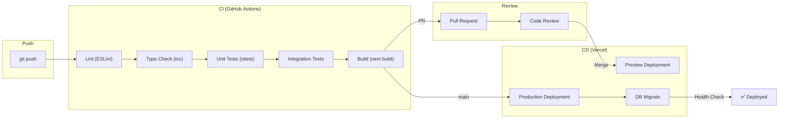

# Architecture 24: CI/CD Architecture

## Purpose
Define the continuous integration and deployment pipeline for automated testing, building, and deployment.

## Pipeline Overview



## GitHub Actions Workflow

```yaml
name: CI/CD
on:
  push:
    branches: [main, develop]
  pull_request:
    branches: [main]

jobs:
  quality:
    name: Code Quality
    runs-on: ubuntu-latest
    steps:
      - uses: actions/checkout@v4
      - uses: actions/setup-node@v4
        with: { node-version: '20' }
      - run: npm ci
      - run: npm run lint
      - run: npm run typecheck
      
  test:
    name: Tests
    needs: quality
    runs-on: ubuntu-latest
    services:
      postgres:
        image: postgres:15
        env:
          POSTGRES_DB: jamming_test
          POSTGRES_PASSWORD: test
        options: >-
          --health-cmd pg_isready
          --health-interval 10s
          --health-timeout 5s
          --health-retries 5
    steps:
      - uses: actions/checkout@v4
      - run: npm ci
      - run: npx prisma generate
      - run: npm test
  
  deploy:
    name: Deploy
    needs: test
    if: github.ref == 'refs/heads/main'
    runs-on: ubuntu-latest
    steps:
      - uses: actions/checkout@v4
      - run: npm ci
      - run: npx prisma migrate deploy
      - uses: amondnet/vercel-action@v25
        with:
          vercel-token: ${{ secrets.VERCEL_TOKEN }}
          vercel-org-id: ${{ secrets.ORG_ID }}
          vercel-project-id: ${{ secrets.PROJECT_ID }}
          vercel-args: '--prod'
```

## Quality Gates

| Gate | Tool | Threshold |
|------|------|-----------|
| Lint | ESLint | Zero errors |
| TypeScript | `tsc --noEmit` | Zero errors |
| Unit tests | vitest | 100% pass, >80% coverage |
| Build | next build | Zero errors |
| E2E tests | Playwright | 100% pass |
| Bundle size | next build | < 500KB initial JS |

## Branch Strategy

| Branch | CI | CD | Env |
|--------|----|----|-----|
| `feature/*` | Lint + TypeCheck | ❌ | Local |
| `develop` | Full test suite | Preview | Staging |
| `main` | Full test suite | Production | Production |

## Rollback Strategy

```bash
# Immediate rollback via Vercel
vercel rollback jamming --time=5m

# Database rollback
npx prisma migrate resolve --rolled-back <migration-name>
```
