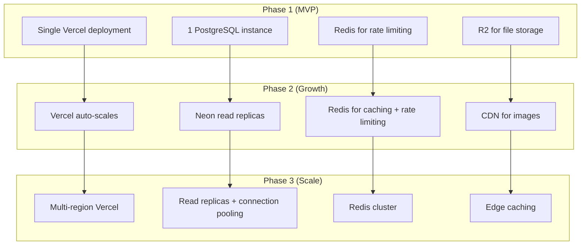
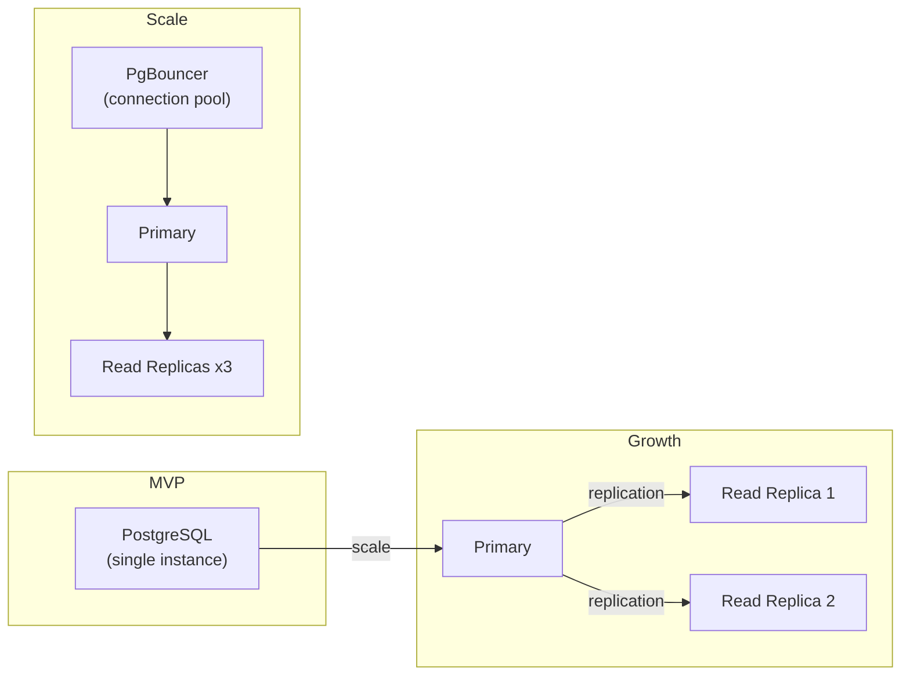

# Architecture 26: Scalability Strategy

## Purpose
Define how the platform scales from MVP (100s of users) to production scale (10,000s of users).

## Current Scale (MVP)

| Metric | Target | Bottleneck |
|--------|--------|------------|
| Users | < 10,000 | None |
| Events | < 50 | None |
| Tickets | < 10,000 | None |
| Check-in throughput | 100/min | None |

## Scaling Triggers

| Trigger | Action | Timeline |
|---------|--------|----------|
| API latency > 500ms p95 | Add Redis caching layer | 1 day |
| DB CPU > 80% | Upgrade Neon plan, add read replica | 1 hour |
| Image load > 2s | Add CDN caching | 1 hour |
| Concurrent users > 500 | Vercel auto-scaling handles it | Automatic |
| Scan throughput > 100/min | Review scan query performance | 1 day |

## Scaling Strategy by Layer

## Database Scaling

## Caching Strategy

| Cache | What | TTL | Invalidation |
|-------|------|-----|-------------|
| Redis (Upstash) | Event listings, event count | 5 min | On event CRUD |
| Redis | Rate limit counters | Sliding window | Auto-expiry |
| Browser (CDN) | Static assets, images | 1 year | Cache-busting hash |
| TanStack Query | API responses | stale-while-revalidate | On mutation success |
| Local Storage | User preferences, session | Until logout | Manual |

## Stateless Design

The application is designed to be stateless:

- **Session:** JWT (no server-side session)
- **Cache:** External Redis (not in-memory)
- **Files:** R2 (external storage)
- **State:** Database (single source of truth)
- **Deployment:** Any Vercel region

This means the app can scale horizontally by simply adding more instances.

## Cost Scaling

| Component | MVP (500 users/month) | Growth (5,000 users/month) | Scale (50,000 users/month) |
|-----------|-----------------------|---------------------------|---------------------------|
| Vercel | Free/Hobby ($20) | Pro ($20) | Enterprise ($300+) |
| Neon | Free tier | Scale ($70) | Enterprise ($700+) |
| Redis (Upstash) | Free (10k req/day) | Pro ($25) | Pro+ ($100+) |
| R2 | Free (10GB) | Paid ($0.015/GB) | Paid |
| Stripe | Pay-as-you-go | Pay-as-you-go | Negotiated |
| Resend | Free (100/day) | Growth ($20) | Pro ($100) |
| Sentry | Free (5k events) | Team ($26) | Business ($60) |
| **Total** | **~$20-40/mo** | **~$150-200/mo** | **~$500-1000/mo** |
